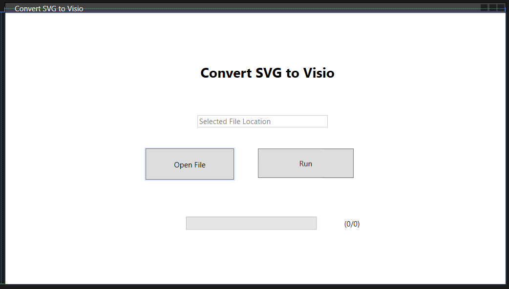

# ConvertSVGtoVisio

Converts SVG files to Visio files (VSDX). This requires visio to be installed on the client machine.

Install the solution it by running the setup file in \Setup1\Debug\Setup1.msi.

